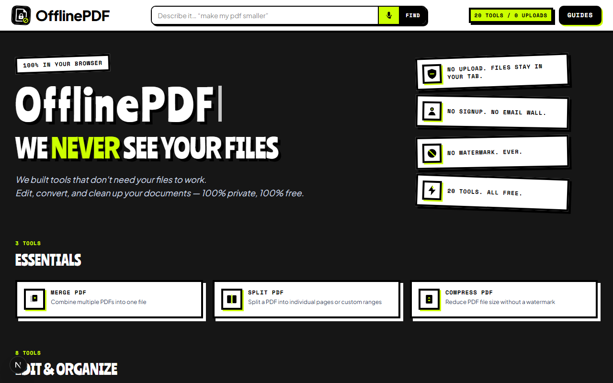

# OfflinePDF

OfflinePDF is a privacy-first set of PDF tools that run entirely in your browser. Files are never uploaded — there are no accounts, no file limits tied to a subscription, and no watermarks.



**Live site:** hosted on [Vercel](https://vercel.com) (set `NEXT_PUBLIC_SITE_URL` to your production domain).

---

## Why OfflinePDF

Most free PDF websites work by uploading your document to a server, processing it there, and sending it back. OfflinePDF does the opposite — every tool runs locally, in your browser, using the device's own processing power. Close the tab and the file is gone; nothing was ever sent anywhere.

- **Works offline after your first visit.** The site saves what it needs to run — the pages, the app code, and the tools' processing engines — so it keeps working without an internet connection. This applies to every tool except **P2P Share** and **Whiteboard**, which need a live connection by design and will show an "unavailable offline" message. The files needed for offline use finish saving a few seconds after your first visit, so give it a moment before going offline.
- **42 tools**, organized into five groups: essentials, edit & organize, security, convert, and capture & share.
- **Size limits by tool type** — lighter tools allow files up to 300 MB; heavier tools up to 150 MB; the OCR tool allows up to 75 MB or 75 pages.
- **Search and voice search** in the header to quickly find the right tool.

---

## Tools

| Category | Tools |
|----------|--------|
| **Essentials** | [Merge PDF](https://offlinepdf-woad.vercel.app/merge-pdf), [Split PDF](https://offlinepdf-woad.vercel.app/split-pdf), [Compress PDF](https://offlinepdf-woad.vercel.app/compress-pdf) |
| **Edit & Organize** | [Organize Pages](https://offlinepdf-woad.vercel.app/organize-pages), [Add Watermark](https://offlinepdf-woad.vercel.app/add-watermark), [Extract Text](https://offlinepdf-woad.vercel.app/extract-text), [Rotate PDF](https://offlinepdf-woad.vercel.app/rotate-pdf), [Crop & Resize](https://offlinepdf-woad.vercel.app/crop-resize), [Page Numbers](https://offlinepdf-woad.vercel.app/page-numbers), [Headers & Footers](https://offlinepdf-woad.vercel.app/headers-footers), [OCR PDF](https://offlinepdf-woad.vercel.app/ocr-pdf), [Compare PDFs](https://offlinepdf-woad.vercel.app/compare-pdfs), [Repair PDF](https://offlinepdf-woad.vercel.app/repair-pdf), [Edit PDF Text](https://offlinepdf-woad.vercel.app/edit-pdf-text) |
| **Security** | [Encrypt PDF](https://offlinepdf-woad.vercel.app/encrypt-pdf), [Remove Password](https://offlinepdf-woad.vercel.app/remove-password), [Flatten PDF](https://offlinepdf-woad.vercel.app/flatten-pdf), [Redact PDF](https://offlinepdf-woad.vercel.app/redact-pdf), [Privacy Scanner](https://offlinepdf-woad.vercel.app/privacy-scanner), [Fingerprint PDF](https://offlinepdf-woad.vercel.app/fingerprint-pdf) |
| **Convert** | [PDF to JPG](https://offlinepdf-woad.vercel.app/pdf-to-jpg), [Images to PDF](https://offlinepdf-woad.vercel.app/images-to-pdf), [Word to PDF](https://offlinepdf-woad.vercel.app/word-to-pdf), [Invert Colours](https://offlinepdf-woad.vercel.app/invert-colors), [PDF to ZIP](https://offlinepdf-woad.vercel.app/pdf-to-zip), [Markdown to PDF](https://offlinepdf-woad.vercel.app/markdown-to-pdf), [HTML to PDF](https://offlinepdf-woad.vercel.app/html-to-pdf), [CSV to PDF](https://offlinepdf-woad.vercel.app/csv-to-pdf), [Excel to PDF](https://offlinepdf-woad.vercel.app/excel-to-pdf), [PDF to Word](https://offlinepdf-woad.vercel.app/pdf-to-word), [Create PDF](https://offlinepdf-woad.vercel.app/create-pdf), [PDF to EPUB](https://offlinepdf-woad.vercel.app/pdf-to-epub), [PowerPoint to PDF](https://offlinepdf-woad.vercel.app/powerpoint-to-pdf), [PDF to PowerPoint](https://offlinepdf-woad.vercel.app/pdf-to-powerpoint), [PDF to Excel](https://offlinepdf-woad.vercel.app/pdf-to-excel), [PDF to HTML](https://offlinepdf-woad.vercel.app/pdf-to-html), [eBook to PDF](https://offlinepdf-woad.vercel.app/ebook-to-pdf), [PDF to Audio](https://offlinepdf-woad.vercel.app/pdf-to-audio) *(listen only)* |
| **Capture, Share & Create** | [POS Billing](https://offlinepdf-woad.vercel.app/pos-billing), [Scan to PDF](https://offlinepdf-woad.vercel.app/scan-to-pdf), [P2P Share](https://offlinepdf-woad.vercel.app/p2p-share)\*, [Collaborative Whiteboard](https://offlinepdf-woad.vercel.app/whiteboard)\* |

*\* P2P Share and Whiteboard connect two browsers directly to each other for a live session. Files and drawings pass straight between the two people using them and are never stored on any server.*

Step-by-step guides for each tool are available under `/blog`.

---

## SDK package

Twelve of these tools — merge, split, rotate, organize pages, watermark, page numbers, flatten, headers/footers, crop & resize, fingerprint, scan/strip metadata, and CSV to PDF — are also published as a standalone package for other developers to use in their own projects: **[offlinepdf-sdk](https://www.npmjs.com/package/offlinepdf-sdk)**.

```bash
npm install offlinepdf-sdk
```

It lives in this repo at [`packages/offlinepdf-sdk`](packages/offlinepdf-sdk), and the website itself uses it for those 12 tools — so there's a single, shared implementation rather than two copies to keep in sync. See the [usage guide](https://offlinepdf-woad.vercel.app/sdk) for help choosing the right function, or that package's [README](packages/offlinepdf-sdk/README.md) for the full reference and what isn't included yet.

---

## MCP server

The SDK's 12 tools, plus four more (extract text, OCR, repair, and a simplified receipt generator — 17 in total), are also available as a local server that Claude Desktop or Claude Code can call directly: **offlinepdf-mcp**. It gives Claude the same tools as the website, with the same guarantee that nothing leaves your device — including the OCR language model, which is included in the package rather than downloaded separately.

It lives in this repo at [`packages/offlinepdf-mcp`](packages/offlinepdf-mcp). It isn't published anywhere for direct install — see that package's [README](packages/offlinepdf-mcp/README.md) for setup instructions, the full tool list, and what's intentionally left out.

---

## Tech stack

| Layer | Stack |
|-------|--------|
| App | Next.js 16 (App Router, static export), React 19, TypeScript |
| UI | Tailwind CSS 4, `@tailwindcss/typography` |
| PDF | pdf-lib, pdf.js |
| Encrypt | qpdf-wasm (AES-256; extra security headers apply only on encrypt/unlock pages — see `vercel.json`) |
| OCR | tesseract.js (English model included; nothing downloaded at runtime) |
| Word | mammoth (Word to PDF), docx (PDF to Word) |
| PowerPoint | pptxgenjs (PDF to PowerPoint), fflate XML parser (PowerPoint to PDF) |
| Spreadsheets | SheetJS (`xlsx` v0.20.3, loaded from its own CDN) for Excel to PDF and PDF to Excel |
| HTML / Markdown | DOMPurify, marked |
| Zip | fflate |
| Live sharing | PeerJS for direct browser-to-browser connections, Google's connection-brokering service (`p2p-share`, `whiteboard`) |
| Camera & Audio | the browser's own camera access (`scan-to-pdf`) and text-to-speech (`pdf-to-audio`) |
| QR Codes | qrcode-generator (`p2p-share`, `whiteboard`) |
| Hosting | Vercel (deploys automatically from `main`) |

All processing runs through a single background worker (`lib/workers/pdf.worker.ts`) that loads the code for each tool only when it's needed.

---

## Quick start

```bash
npm install
npm run dev      # http://localhost:3000
npm run build    # static site → out/
```

> **Note:** the local dev server does not apply the production security headers defined in `vercel.json`. Encrypt PDF needs those headers to work, so use `npm run build && npm run e2e` (or a Vercel preview) to test it end-to-end.

### Useful scripts

| Script | Purpose |
|--------|---------|
| `npm run lint` | Code style check |
| `npm run check:limits` | Verifies the file-size limits are configured correctly |
| `npm run check:engines` | Quick smoke test of each tool's processing engine |
| `npm run build` | Production build (static export) |
| `npm run check-links` | Confirms every internal link in the built site resolves |
| `npm run e2e` | Full browser test suite against the production build; confirms no outside network requests are made |
| `npm run ci` | Runs lint, limits, engines, build, and link checks in sequence |
| `node scripts/capture-screenshot.mjs` | Captures a fresh homepage screenshot for this README |

---

## CI / CD

GitHub Actions (`.github/workflows/ci.yml`) runs on every push and pull request to `main`:

1. Install dependencies
2. Lint and basic checks (`check:limits`, `check:engines`)
3. Production build
4. Link check on the built site
5. End-to-end tests (Chromium)

**One setup requirement:** installing dependencies needs access to **`https://cdn.sheetjs.com`**. The spreadsheet library this project depends on (`xlsx`, version 0.20.3) is only distributed from that address — the copy on the regular npm registry is an older version with known security issues. This applies to local setup, GitHub Actions, and the Vercel build alike. If you're behind a restrictive network or proxy, allow that address, or download the file once and host it yourself (updating the install address in `package.json`). Because it isn't installed from the npm registry, routine dependency-vulnerability scans can't check it automatically — when upgrading, check the [SheetJS changelog](https://docs.sheetjs.com/docs/miscellany/changelog) by hand and update the version in the install address. The lockfile records a checksum of the exact file used, so installs stay consistent.

**Deploying:** Vercel builds and hosts the site directly from this repository. Pushing to `main` deploys to production; pull requests get their own preview link. GitHub Actions is the quality gate; Vercel is the host.

Set `NEXT_PUBLIC_SITE_URL` in the Vercel project once a custom domain is attached — it feeds the sitemap, robots file, and page previews (`lib/site.ts`).

---

## Project layout

```
app/                 Home page, tool pages, blog, privacy, terms
components/          Header (search + voice), upload, download, shared tool UI
lib/tools.ts         Tool registry (titles, descriptions, how-to steps)
lib/pdf/             File validation, size limits, load/render helpers
lib/p2p/             Connection handling for P2P Share & Whiteboard
lib/workers/         Background worker and the per-tool engines it loads
content/blog/        Written guides
scripts/             Build helpers, screenshot capture, tests, link checking
.github/workflows/   CI configuration
docs/                Documentation assets (screenshot.png)
```

---

## Privacy

Files are read into memory in your browser, processed there, and offered back to you as a download. They are never uploaded to OfflinePDF's servers. Passwords used to encrypt or unlock a file never leave your device.

- **No upload, by default:** 40 of the 42 tools make zero network requests while processing your file.
- **P2P Share & Whiteboard, disclosed:** these two tools connect two browsers directly for a live session. To set up that connection, the browser contacts a connection-brokering service, which sees IP addresses and session IDs but never file contents or drawings. Once connected, everything passes directly between the two browsers and is never stored on a server.
- **Error reporting (optional, set per deployment):** if enabled by the site operator, unexpected tool failures send a short, automatically-scrubbed error report — never file data — to help diagnose the issue. This is limited to a small number of reports per visit.
- **Camera access:** Scan to PDF uses your device camera directly in the page, with no upload.

See `/privacy` and `/terms` on the live site for full details.
